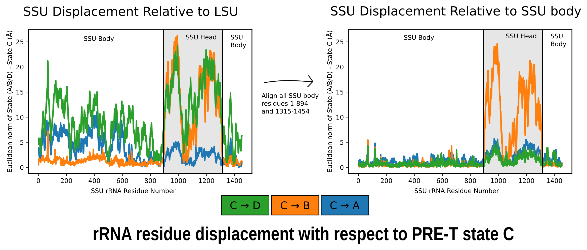
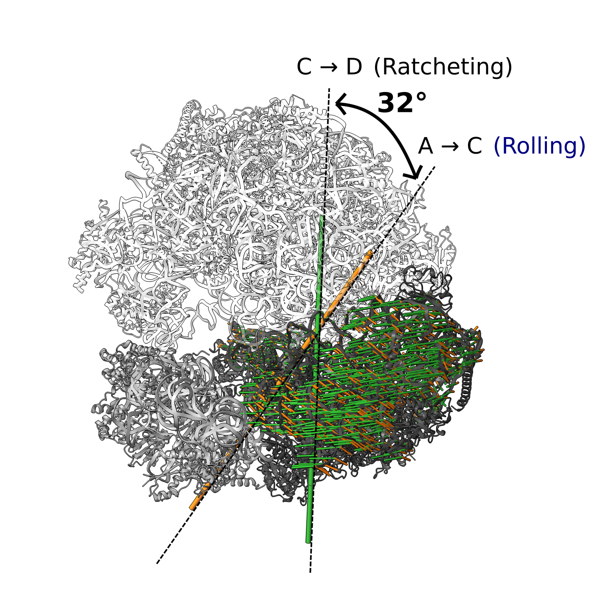
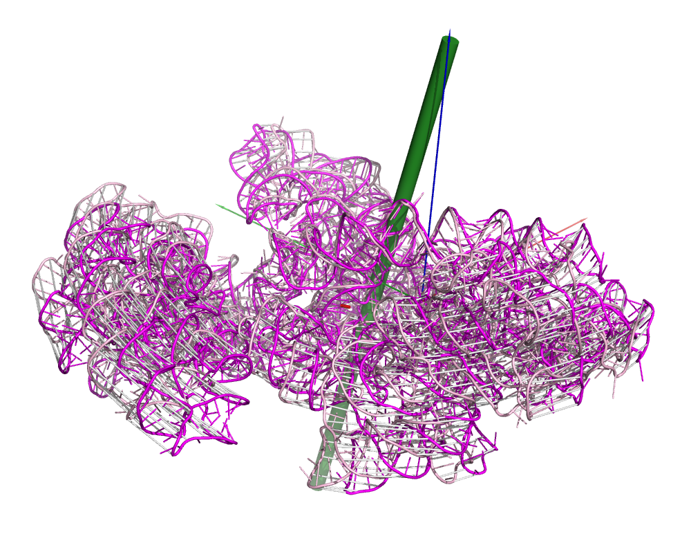

# ribosome-building-analysis
Code used in the study: "Insights into Translocation Mechanism and Ribosome Evolution from Cryo-EM Structures of Translocation-Intermediates of Giardia intestinalis."

## svd_axis_angle
A set of scripts to determine the rotation characeristics of translocation intermediates in a pairwise fashion.  
Measure the 3-dimensional distance between rRNA residues of two structures.  
Determine the rotational axis and rotation vectors (between phosphates for instance) between two intermediate states.  
Compare rotational axes between transitions.  
  
Scripts with the prefix 'a_' to 'f_' allow you to use any set of coordinates or transformation matrices.
The script 'x_show_rot_vectors_all_pymol.py' is a PyMOL script that will do all the calculations of the previous six scripts within PyMOL, and also output a ChimeraX bild file for that allows you to visualise the rotation axes and vectors in ChimeraX.

  
3-dimensional distance between rRNA residues from one translocation intermediate to another (left) with the small subunit (SSU) body residues aligned (right).

  
Comparison of ratcheting and rolling rotational axes for Giardia translocation intermediates. Rotational axes shown as large cylinders, small cylinders represent vectors between initial and final points of the transition.  

  
Visual output of the script 'x_show_rot_vectors_all_pymol.py'. In addition to this, all calculations are output to console as well as to file to allow for further analysis. See the script comments for details.

## coot_progressive_refinement
A script to perform real space refinement in Coot using a docked structure. This script orders the residues to be refined by their distance from the (macro)molecule's centre of mass. Then it performs this refinement in a step-wise fashion in a sphere of a given radius (determined by the user, some choices in the Coot menu are 8 and 25 Å).
